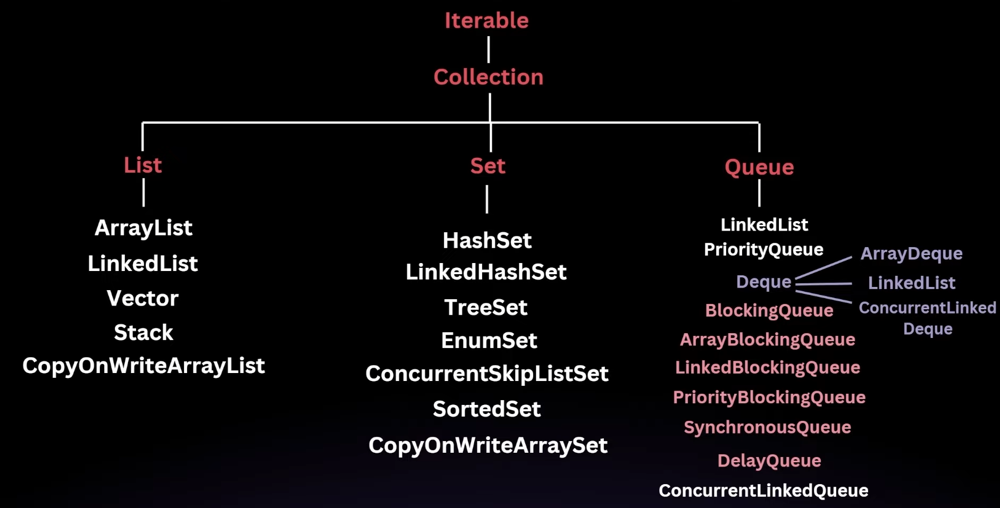

## Java Collection

## What is a Collection Framework?

It provides a set of interfaces and classes that help in managing groups of Object.

## What was before Collections Framework?

Collections was introduced in JDK 1.2. Before that Java used to rely on a variatey of Classes like Vector, Stack, Hashtable, and arrays to store ad manipulate groups of objects.

## Drawbacks of objects before Collection Framework →

1. Inconsistency: Each class had a different way of managing collections, leading to confusion and a steep learning curve.
2. Lack of inter-operability: These classes were not designed to work together seamlessly
3. No common interface: There was no common interface for all these classes, which meant you couldn’t write generic algorithms that could operate on different types of collections.

## Advantages of Collection Framework:

1. Unified architecture: A Consistent set of interfaces for all collections.
2. Inter-Operability: Collections can be easily interchanged and manipulated in a uniform way.
3. Reusability: Generic algorithms can be written that work with any collection.
4. Efficieny: The framework provides efficient algorithms for basic operations like searching, sorting, and manipulation.

## What are the different interfaces in Java Collection:

Collection: The root interface for all the other collection types.

List: An ordered collection that can contain duplicate elements (e.g., ArrayList, LinkedList)

Set: A collection that cannot contain duplicate elements (e.g. HashSet, TreeSet).

Queue: A collection designed for holding elements prior to processing (e.g., PriorityQueue,

LinkedList when used as a Queue).

Deque: A double-ended queue that allows insertion and removal from both ends (e.g., ArrayDeque).

Map: An interface that represents a collection of key-value pairs (e.g., HashMap, TreeMap).

## Overview of Collection Interface :

The Collection interface is the root interface of the Java Collection Framework. It is the most basic interface that definews a group of Objects known as elements. The Collection interface is a part of java.util package, and It is a parent interface that is extended by other collection interfaces like List, Set and Queue.

Since collection is an interface, it cannot be instantiated directly; rather, it provides a blueprint for the basic operations that are common to all collections.

The collection interface defines a set of core methods that are implemented by all the classes that implement the interface. These methods allow for basic operations such as adding, removing, and checing the existence of elements in a collection.

Collection Interface Methods:

size() -  `*the number of elements in this collection*`

isEmpty() - `*Returns {@code true} if this collection contains no elements.*`

contains()- `*@return {@code true} if this collection contains the specified*         element*`

iterator() - `*@return an {@code Iterator} over the elements in this collection*`

toArray()- `*This method acts as a bridge between array-based and collection-based APIs.**`

`*It returns an array whose runtime type is {@code Object[]}.**`

`*Use {@link #toArray(Object[]) toArray(T[])} to reuse an existing* array, or use {@link #toArray(IntFunction)} to control the runtime type* of the array.*`

add() - `*@return {@code true} if this collection changed as a result of the*         call*`

remove() -  `*@return {@code true} if an element was removed as a result of this call*`

containsAll() - `*@return {@code true} if this collection contains all of the elements*         in the specified collection*`

addAll() -`*@return {@code true} if this collection changed as a result of the call*`

removeAll() - `*@return {@code true} if this collection changed as a result of the*         call*`

removeIf() -  `*@return {@code true} if any elements were removed*`

`*@param filter a predicate which returns {@code true} for elements to be*        removed*`

retainAll() -`*@param c collection containing elements to be retained in this collection*`

`*@return {@code true} if this collection changed as a result of the call*`

clear() - `*Removes all of the elements from this collection (optional operation).* The collection will be empty after this method returns.*`

equals() -  `*@param o object to be compared for equality with this collection**`

`*@return {@code true} if the specified object is equal to this* collection*`

hashCode() -  `*@return the hash code value for this collection*`

spliterator() - `*@return a {@code Spliterator} over the elements in this collection*`

stream() - `*@return a sequential {@code Stream} over the elements in this collection*`

parrellelStream() - `*@return a possibly parallel {@code Stream} over the elements in this* collection*`